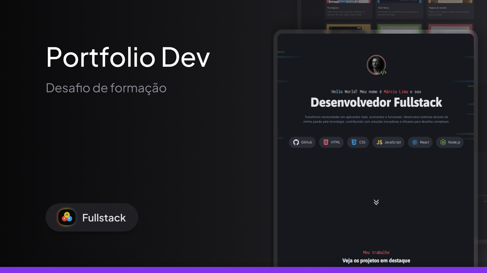

<h1 align="center"> Portfólio Dev </h1>

  Projeto de portfólio profissional desenvolvido como parte da minha formação em desenvolvimento web, focando na aplicação prática de conceitos intermediários de CSS e estruturação de projetos.

  <a href="#-tecnologias">Tecnologias</a>&nbsp;&nbsp;&nbsp;|&nbsp;&nbsp;&nbsp;
  <a href="#-projeto">Projeto</a>&nbsp;&nbsp;&nbsp;|&nbsp;&nbsp;&nbsp;
  <a href="#-aprendizados">Aprendizados</a>&nbsp;&nbsp;&nbsp;|&nbsp;&nbsp;&nbsp;
  <a href="#-como-visualizar">Como Visualizar</a>&nbsp;&nbsp;&nbsp;|&nbsp;&nbsp;&nbsp;
  <a href="#memo-licença">Licença</a>

  

 

  

## 🚀 Tecnologias

Esse projeto foi desenvolvido utilizando as seguintes tecnologias e ferramentas:

- **HTML5** (Estruturação semântica)
- **CSS3** (Estilização avançada e Layouts)
- **JavaScript** (Interatividade e manipulação do DOM)
- **SweetAlert2** (Biblioteca para alertas personalizados)
- **Git e Github** (Versionamento e hospedagem)

## 💻 Projeto

O **Portfólio Dev** é uma aplicação web que serve como cartão de visitas digital e vitrine de projetos. Este projeto foi fundamental para consolidar conhecimentos de **CSS Intermediário**, onde cada elemento visual foi construído pensando na semântica, organização e experiência do usuário.

## 🎓 Aprendizados

Como este é um projeto de formação, cada linha de código representa um novo conceito assimilado. Abaixo detalho os aprendizados técnicos aplicados em cada parte do sistema:

### 🏗️ HTML5 & Estrutura
- **Tags Semânticas:** Uso correto de `<header>`, `<section>`, `<footer>` e `<main>` para melhorar a leitura do código e SEO.
- **Acessibilidade:** Textos alternativos em imagens (`alt`) e estruturação hierárquica de títulos (`h1` a `h5`).
- **Importação de Recursos:** Links para folhas de estilo externas, ícones (favicon) e scripts.
- **SVG Inline:** Manipulação direta de códigos SVG no HTML para ícones vetoriais de alta qualidade.

### 🎨 CSS3 Intermediário & Estilização
- **Variáveis CSS (:root):** Criação de um *Design System* centralizado para cores (`--red`, `--gray-100`), fontes e tamanhos, facilitando a manutenção global.
- **Layouts Modernos:**
  - **CSS Grid:** Estruturação complexa da galeria de projetos e seção de serviços (definição de colunas, linhas e `gap`).
  - **Flexbox:** Alinhamento de elementos internos (ícones, textos, tags) e distribuição de espaço no cabeçalho e rodapé.
- **Interatividade & Micro-interações:**
  - **Pseudo-classes (:hover):** Efeitos visuais ao passar o mouse sobre cards, avatares e links.
  - **Transitions & Transforms:** Animações suaves de escala (`scale`) e mudança de cores, tornando a navegação mais fluida.
- **Backgrounds:** Manipulação de imagens de fundo (`background-image`, `size`, `repeat`) para criar as seções visuais impactantes.
- **Reset & Box Model:** Padronização de margens e preenchimentos (`box-sizing: border-box`) para garantir consistência entre navegadores.

### ⚡ JavaScript & DOM
- **Manipulação do DOM:** Seleção de elementos (`querySelector`, `getElementById`) para criar comportamentos dinâmicos.
- **Event Listeners:** Escuta de eventos de clique para acionar funções específicas.
- **Integração de Bibliotecas:** Uso do **SweetAlert2** para substituir os alertas padrões do navegador por modais estilizados e responsivos.
- **Scroll Behavior:** Implementação de rolagem suave ao navegar entre as seções da página.

## 📂 Como Visualizar

1.  Clone o repositório ou baixe os arquivos.
2.  Navegue até o diretório do projeto.
3.  Abra o arquivo `index.html` no seu navegador preferido.

## :memo: Licença

Esse projeto está sob a licença MIT.

---

Feito com ♥ por [Márcio Sykes](https://www.instagram.com/marcio.sykes/#) 𓅓